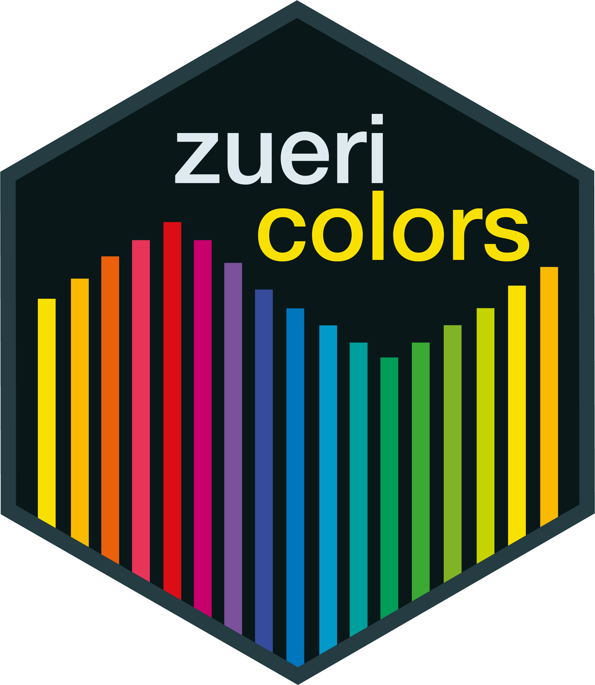
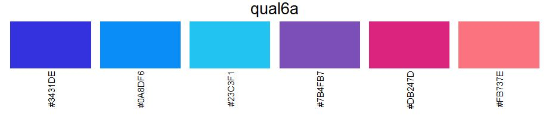
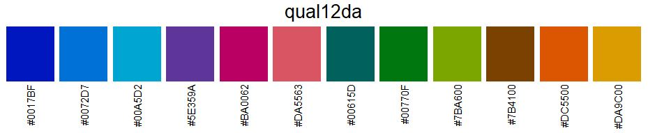
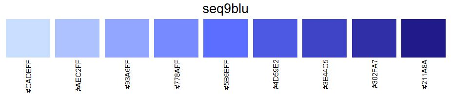
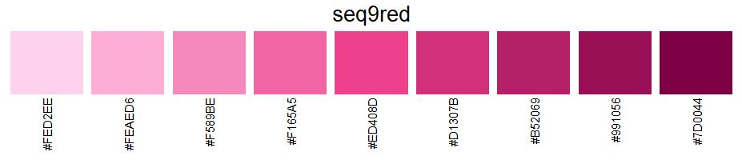
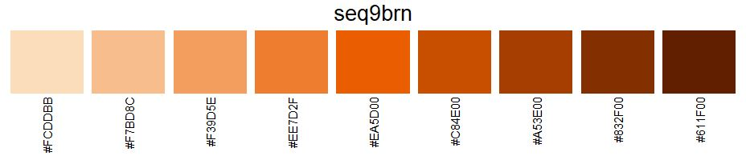
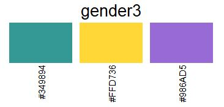

# zuericolors

<!-- badges: start -->
[](https://CRAN.R-project.org/package=zuericolors)
[](https://github.com/StatistikStadtZuerich/zuericolors/actions/workflows/R-CMD-check.yaml)
[](https://cmp-sdlc.stzh.ch/OE-7035/ssz-da/libraries/zueriverse/zuericolors/badges/main/pipeline.svg?key_text=GitLabPipeline&key_width=100)
<!-- badges: end -->

zuericolors is an R-Package, which provides specific colors according to the corporate design of the city of Zurich. The package contains all colors that [Statistik Stadt Zürich](https://www.stadt-zuerich.ch/prd/de/index/statistik.html) needs for the creation of graphs. There are two main functions in zuericolors:

-   `get_zuericolors` extracts colors of a specific color palette and puts them into a vector.
-   `view_zuericolors` prints a specific color palette. Is useful for visual inspection.

For the creation of CI/CD conform ggplot2 graphs see the [zueritheme](https://github.com/StatistikStadtZuerich/zueritheme) and [zueriplots](https://github.com/StatistikStadtZuerich/zueriplots) repositories.

## Installation

The easiest way to get zuericolors is to install it from this repo:

``` r
# install.packages("devtools")
devtools::install_github("StatistikStadtZuerich/zuericolors")
```

Alternatively, download the files (by clicking 'Clone or download' / 'Download Zip'), extract it to any location on your computer, e.g. to your Desktop and then run:

``` r
remotes::install_local("<path_to_location>/zuericolors-main")
```

## Version

To check your version of zuericolors, run:

``` r
packageVersion("zuericolors")
```

## Examples

``` r
library(zuericolors)

# Get all the colors from palette "qual6"
get_zuericolors("qual6")

[1] "#3431DE" "#DB247D" "#1D942E" "#FBB900" "#23C3F1" "#FF720C"

# Get first color from palette "div9ntrgry"
get_zuericolors("div9ntrgry", nth = 1)

"#A30059"

# Get first four colors from palette "qual12"
get_zuericolors("qual12", nth = 1:4)

[1] "#3431DE" "#0A8DF6" "#23C3F1" "#7B4FB7"

# View color palette "qual12"
view_zuericolors("qual12")
```


## Usage

### Grey Palette

The grey color palette is not a palette in the true sense. However, its individual colors are needed for different features in [sszviz](https://github.com/StatistikStadtZuerich/sszvis):

-   LightGry `#FAFAFA`: A light grey scale is included for use in cases where a data background should be shaded out.
-   PaleGry `#EAEAEA`: A pale grey shade which is used for elements which should be in the background, but shouldn't completely fade out. Currently used as the color of the links in the [sankey diagram](https://statistikstadtzuerich.github.io/sszvis/#/sankey).
-   Gry `#D6D6D6`: A grey scale is included for use in cases where a data value should be shaded out. Currently, it is used for the color of inactive lines in the coordinated map and line chart example. At the moment, it has only one value.
-   DimGry `#B8B8B8`: A dim grey shade used for highlighting elements which are normally grey (sszvis.scaleGry()). Currently, it is used as the highlight color in the [bubble map](https://statistikstadtzuerich.github.io/sszvis/#/map-signature).
-   MedGry `#7C7C7C`: The medium grey color, as a standalone value.
-   DeepGry `#545454`: The deep grey color, as a standalone value.


### Qualitative Palettes

Qualitative palettes are used for data that has distinct categories. They distinguish categories based on color contrast. They should never be used to compare values, use sequential or divergent palettes in this case.







### Sequential Palettes

Sequential palettes are used to compare values. These palettes are designed to have the same brightness for the same input value.








### Divergent Palettes

Divergent palettes are used to compare data that has two extremes. These scales are designed to have the same brightness for the same input value. They come in two color variations: the valued (red-green) variation is used for data that has negative-positive characteristics, the neutral (brown-blue) variation is used in cases where no valuation is wanted.


### Palettes for Gender, Origin and Marriage

`#349894` is used for women, `#FFD736` for men, and `#986AD5` for people who identify as non-binary.



`#349894` is also used for female foreigners (and `#00615D` for Swiss female), `#FFD736` for male foreigners (and `#DA9C00` for Swiss male), and `#986AD5` for foreigners who identify as non-binary (and `#5E359A` for Swiss individuals who identify as non-binary).


`#349894` is used to depict a marriage between two women, and `#FFD736` for a marriage between two men. Same-sex marriages, in general, are represented by the color `#3431DE`. For a marriage between a woman and an unknown partner, `#B8B8B8` is used, while `#D6D6D6` is used for a marriage between a man and an unknown partner.


## Getting help

If you encounter a bug, please contact [statistik\@zuerich.ch](mailto:statistik@zuerich.ch){.email}.
